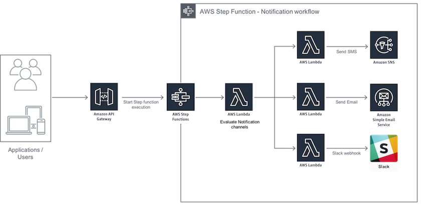

# Building your Notifications Workflow with Step Functions

Notifying people in different channels is a daunting experience, whether that is for paging purposes or purely for a contextual notification. In this example, we will use AWS Step Functions to create a Notifications Workflow and Amazon API Gateway to create a simpler API to notify people be that on email, SMS or Slack.
___

## Prerequisites

The following prerequisties must be met before you begin the workshop:

- AWS Console Access
- A [Slack webhook](https://api.slack.com/incoming-webhooks#) to post messages to the Slack channel
- Verify your email address with Amazon SES to send email from your email address. For instructions, see [Verifying Email Addresses](https://docs.aws.amazon.com/ses/latest/DeveloperGuide/verify-email-addresses-procedure.html) in Amazon SES. 

___

### Architecture
This example uses a simple architecture, hosting a static website in [Amazon Simple Storage Service](https://aws.amazon.com/s3/) (Amazon S3) to invoke an [Amazon API Gateway](https://aws.amazon.com/api-gateway/) API. The API is configured with an AWS Service integration which invokes the [AWS Step Function](https://aws.amazon.com/step-functions/) state machine for the notifications workflow. Along the way, the task states in the state machine are executing [AWS Lambda](https://aws.amazon.com/lambda/) functions which send SMS via [Amazon Simple Notification Service](https://aws.amazon.com/sns/), email via [Amazon Simple Email Service](https://aws.amazon.com/ses/) and messages to Slack channel via Slack webhook.

This repository contains sample code for step function, all the Lambda functions depicted in the diagram as well as an AWS CloudFormation template to create the requied IAM roles and S3 bucket for hosting static web site.
___

## Workshop Activities

1. [Lab Setup](lab-guides/lab-setup.md)
2. [Creating Lambda functions](lab-guides/create-lambda-functions.md)
3. [Creating a state machine](lab-guides/create-state-machine.md)
4. [Creating and deploying Notification workflow API Using API Gateway](lab-guides/create-api.md)
5. [Deploying test application and testing the NotificationAPI](lab-guides/test-application.md)
6. [Optional : Adding manual approval step to the workflow](lab-guides/optional-manual-approval.md)
7. [Clean Up](lab-guides/cleanup.md)

## License

This library is licensed under the MIT-0 License. See the LICENSE file.

___