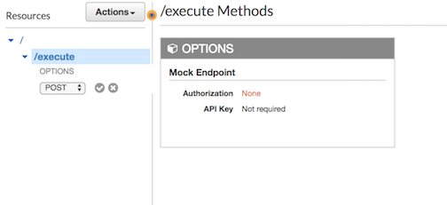
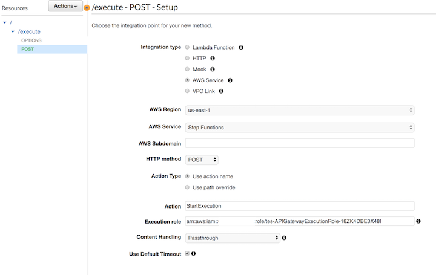
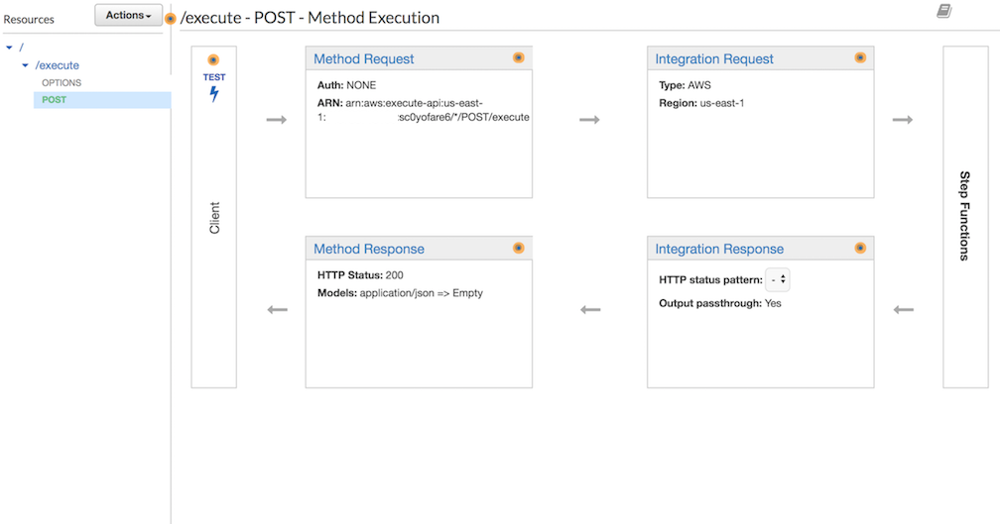
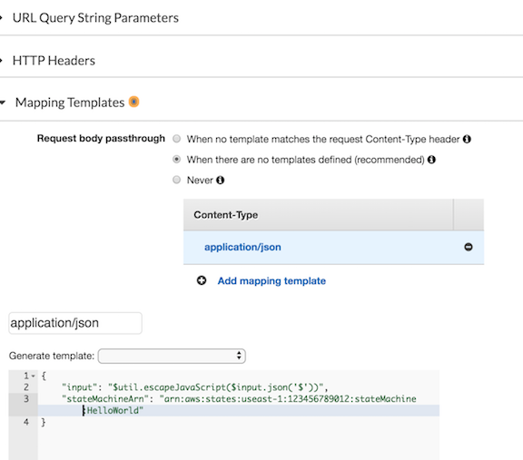
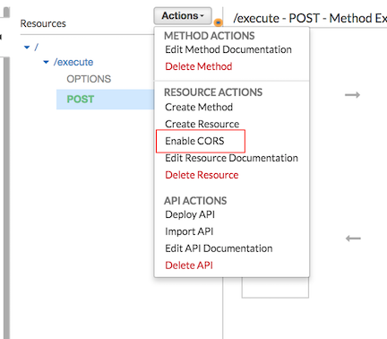

[Back to main guide](../README.md)|[Next](test-application.md)

___

# 4. Creating and deploying Notification workflow API Using API Gateway

You will use Amazon API Gateway to associate your AWS Step Functions execution API action with methods in an API Gateway API, so that, when an HTTPS request is sent to an API method, API Gateway invokes your Step Function's StartExecution API action.

Optionally you can import the API configurations from [swagger file](../cfn-templates/NotificationAPI-stage-swagger-apigateway.yaml) directly in to API Gateway by replacing the role arns and state machine arn.
___

## Task 1 - Creating API Gateway API

### To create the API
1. Navigate to the [Amazon API Gateway console](https://console.aws.amazon.com/apigateway/) and choose **Get Started**.
2. On the **Create new API** page, choose **New API**.
3. In the **Settings** section, type `NotificationAPI` for the **API name**, and then choose **Create API**.

### To create a resource
1. On the **Resources** page of `NotificationAPI`, choose **Actions, Create Resource**.
2. On the **New Child Resource** page, type `execution` for **Resource Name**, and then choose **Create Resource**.

### To create a POST Method
1. On the **/execution** methods page, choose **Actions, Create Method**.
2. From the list, choose `POST`, and then select the checkmark.
    

### To configure the method
1. On the **/execution - POST - Setup** page, configure the integration point for your method.
2. For **Integration Type**, choose **AWS Service**.
3. For **AWS Region**, choose the **region** where you have created step function.
4. For **AWS Service**, choose **Step Functions** from the list.
5. For **HTTP Method**, choose **POST** from the list.
6. For **Action Type**, choose **Use action name**.
7. For **Action**, enter `StartExecution`.
8. For **Execution Role**, type the role **ARN of the IAM role (APIGatewayExecutionRoleArn)**  created by the cloud formation template.
     
9. Choose **Save**.

The visual mapping between API Gateway and Step Functions is displayed on the **/execution - POST - Method Execution** page.
     

### To configure Body Mapping Template
1. Navigate to the **Integration Request** section
2. Choose **Mapping Templates** and click on **Add mapping template**. 
3. Create a Content Type `application/json` and copy the following mapping template. Update **stateMachineArn** with your **NotificationWorkflow** state machine ARN 

```JavaScript
{ 
    "input": "$util.escapeJavaScript($input.json('$'))",
    "stateMachineArn": "arn:aws:states:<region>:<Account_id>:stateMachine:NotificationWorkflow"
}
```



### Enable CORS
1. Choose a **POST method** under **Resources**.
2. Choose **Enable CORS** from the **Actions** drop-down menu.

     

3. In the next screen, Choose **Enable CORS and replace existing CORS headers**.
4. In Confirm method changes, choose **Yes, overwrite existing values** to confirm the new CORS settings.
___


## Task 2 - deploying NotificationAPI 

1. On the **Resources** page of **NotificationAPI**, choose **Actions, Deploy API**.

2. In the **Deploy API** dialog box, select **[New Stage]** from the **Deployment stage** list, type `stage` for **Stage name**, and then choose **Deploy**.

### Make a note of NotificationAPI URL 
1. On the **Stages** page of **NotificationAP** , expand **stage, /, /execution, POST**.
2. On the **stage, /, /execution, POST** page, note down the **Invoke URL**, for example:
```
https://a1b2c3d4e5.execute-api.us-east-1.amazonaws.com/stage/execution
```
___

[Back to main guide](../README.md)|[Next](test-application.md)