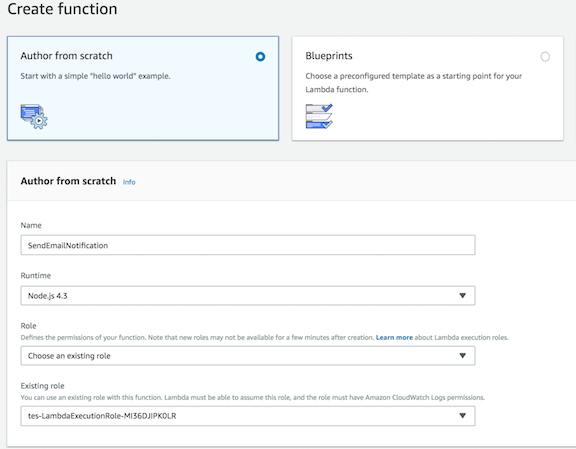

[Back to main guide](../README.md)|[Next](create-state-machine.md)

___

# 2. Creating application functions
The Notifications workflow application has four lambda functions that are triggered by the Step function to send email, SMS and/or slack message. 
-	SendEmailNotification function sends an email to the specified email id using Amazon SES.
-	SendSMSNotification function sends a SMS to the specified phone number using Amazon SNS.	
- 	SendSlackNotification function sends a message to a Slack channel via slack webhook.
-   EvaluateRequest function evaluates input to determine requested notification channels
___

## Task 1 - Create SendEmailNotification function

1.	Log in to the [Lambda console](https://console.aws.amazon.com/lambda/home) and choose Create a function.
2.	On the Create function page 
	- Choose **Author from scratch** option
	- For **Name**, specify `SendEmailNotification` as Lambda function name
	- For **Runtime**, choose `Node.js 4.3`
	- For **Role**, Select `Choose an existing role` 
	- For **Role name**, choose lambda execution role created by your cloud formation template.
	- Choose **Create Function**

	

3.	Under your new function page, 
	- Choose **Code entry type** as `Edit code inline`
	- Copy below code in `index.js` and Choose **Save**

```JavaScript

'use strict';

const aws = require('aws-sdk');
const ses = new aws.SES(); 

exports.handler = (event, context, callback) => 
{
   console.log(JSON.stringify(event));
    var emailParams = {
        Destination:
        {
            ToAddresses: [
                event.email.emailAddress
            ]
        },
        Message:
        {
            Subject:
            {
                Data: event.email.subject,
                Charset: 'UTF-8'
            },
            Body:
            {
                Html:
                {
                    Data: event.email.messageBody,
                    Charset: 'UTF-8'
                }
            }
        },
        Source: event.email.emailAddress,
        ReplyToAddresses: [
            event.email.emailAddress
        ]
    };
   console.log(JSON.stringify(emailParams));
    ses.sendEmail(emailParams, function(err, data)
    {
        if (err)
        {
            console.log(err, err.stack);
            context.fail('Internal Error: The email could not be sent.');
        }
        else
        {
            console.log('The email was successfully sent.'+data);
            context.succeed('The email was successfully sent.');
        }
    });
};

```
4. When your Lambda function is created, note its Amazon Resource Name (ARN) in the upper-right corner of the page. For example:
```
arn:aws:lambda:us-east-1:XXXXXXXXXXX:function:SendEmailNotification
```
___

## Task 2 - Create SendSMSNotification function

Repeat the above steps from Task 1 to create a new function with name as `SendSMSNotification` and below function code. 

```JavaScript
'use strict';

const aws = require('aws-sdk');
const sns = new aws.SNS({apiVersion: '2010-03-31'});

exports.handler = (event, context, callback) =>
{
    console.log(JSON.stringify(event));

    // Create publish parameters
    var smsParams = {
        Message: event.sms.messageBody,
        PhoneNumber: event.sms.phoneNumber,
        MessageAttributes: {
           "AWS.SNS.SMS.SMSType" : {
              "DataType": "String",
              "StringValue": "Transactional"
           }
        }
    };

    console.log(JSON.stringify(smsParams));

    sns.publish(smsParams, function(err, data)
    {
        if (err)
        {
            console.log(err, err.stack);
            context.fail('Internal Error: The SMS could not be sent.');
        }
        else
        {
            console.log('The SMS was successfully sent.' + JSON.stringify(data));
            context.succeed('The SMS was successfully sent.');
        }
    });
};

```
___

## Task 3 - Create SendSlackNotification function

Repeat the above steps from Task 1 to create a new function with name as `SendSlackNotification` and below function code. 

```JavaScript
'use strict';
const url = require('url');
const https = require('https');

exports.handler = (event, context, callback) =>
{
    const body = JSON.stringify(event.slack.messageBody);
    const options = url.parse(event.slack.webhook);
    options.method = 'POST';
    options.headers = {
        'Content-Type': 'application/json',
        'Content-Length': Buffer.byteLength(body),
    };
    
    console.log(JSON.stringify(options));

    const postReq = https.request(options, (res) =>
    {
        const chunks = [];
        res.setEncoding('utf8');
        res.on('data', (chunk) => chunks.push(chunk));
        res.on('end', () =>
        {
            console.log(res.statusCode);
            
            if (res.statusCode == 200)
            {
                console.log('Message to Slack channel was successfully sent.' );
                context.succeed('Message to Slack channel was successfully sent.');
            }
        });
        return res;
    });
    postReq.write(body);
    postReq.end();
    
}
```
___

## Task 4 - Create EvaluateRequest function

Repeat the above steps from Task 1 to create a new function with name as `EvaluateRequest` and below function code. 

```JavaScript
'use strict';

exports.handler = (event, context, callback) =>
{
    if (event.email != undefined && event.email.emailAddress != undefined)
        event.isEmail = true;
    else
        event.isEmail = false;
    if (event.sms != undefined && event.sms.phoneNumber != undefined)
        event.isSMS = true;
    else
        event.isSMS = false;
    if (event.slack != undefined && event.slack.webhook != undefined)
        event.isSlack = true;
    else
        event.isSlack = false;
        
   context.done(null, event);
};
```
___
[Back to main guide](../README.md)|[Next](create-state-machine.md)