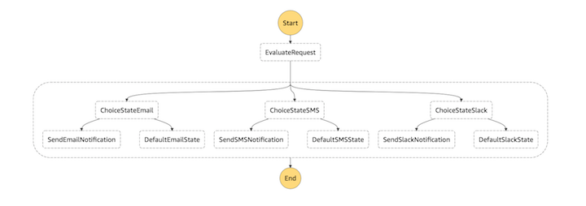

[Back to main guide](../README.md)|[Next](create-api.md)

___

# 3. Creating a state machine

You will create a state machine that models the parallel execution of multiple notification channels based on the input data as illustrated in the below diagram. 



Use the [Step Functions console](https://console.aws.amazon.com/states/home?region=us-east-1#/) to create a state machine with Task states. Update the reference in corresponding task states with your Lambda function ARNs. The Lambda function is invoked when an execution of the state machine reaches particular Task state. 

## Task - Create the state machine
1. Log in to the [Step Functions console](https://console.aws.amazon.com/states/home?region=us-east-1#/) and choose **Create a state machine**.
2. On the Create a state machine page, select **Author from scratch** and enter `NotificationWorkflow` as Name for your state machine.
3. Add the following state machine definition code in the **State machine definition** pane. Remember to replace the value for **Resource** with your corresponding **Lambda ARNs**. 
```JavaScript
{
    "Comment": "State machine for notification workflow!",
    "StartAt": "EvaluateRequest",
    "States":
    {
        "EvaluateRequest":
        {
            "Type": "Task",
            "Resource": "arn:aws:lambda:<region>:<account_id>:function:EvaluateRequest",
            "Next": "NotificationFlow"

        },
        "NotificationFlow":
        {
            "Type": "Parallel",
            "End": true,
            "Branches": [
            {
                "StartAt": "ChoiceStateEmail",
                "States":
                {
                    "ChoiceStateEmail":
                    {
                        "Type": "Choice",
                        "Choices": [
                        {

                            "Variable": "$.isEmail",
                            "BooleanEquals": true,
                            "Next": "SendEmailNotification"
                        }],
                        "Default": "DefaultEmailState"
                    },
                    "SendEmailNotification":
                    {
                        "Type": "Task",
                        "Resource": "arn:aws:lambda:<region>:<account_id>:function:SendEmailNotification",
                        "End": true
                    },
                    "DefaultEmailState":
                    {
                        "Type": "Pass",
                        "Result":
                        {},
                        "End": true
                    }
                }
            },
            {
                "StartAt": "ChoiceStateSMS",
                "States":
                {
                    "ChoiceStateSMS":
                    {
                        "Type": "Choice",
                        "Choices": [
                        {
                            "Variable": "$.isSMS",
                            "BooleanEquals": true,
                            "Next": "SendSMSNotification"
                        }],
                        "Default": "DefaultSMSState"
                    },
                    "SendSMSNotification":
                    {
                        "Type": "Task",
                        "Resource": "arn:aws:lambda:<region>:<account_id>:function:SendSMSNotification",
                        "End": true
                    },
                    "DefaultSMSState":
                    {
                        "Type": "Pass",
                        "Result": "",
                        "End": true
                    }
                }
            },
            {
                "StartAt": "ChoiceStateSlack",
                "States":
                {
                    "ChoiceStateSlack":
                    {
                        "Type": "Choice",
                        "Choices": [
                        {
                            "Variable": "$.isSlack",
                            "BooleanEquals": true,
                            "Next": "SendSlackNotification"
                        }],
                        "Default": "DefaultSlackState"
                    },
                    "SendSlackNotification":
                    {
                        "Type": "Task",
                        "Resource": "arn:aws:lambda:<region>:<account_id>:function:SendSlackNotification",
                        "End": true
                    },
                    "DefaultSlackState":
                    {
                        "Type": "Pass",
                        "Result": "",
                        "End": true
                    }
                }
            }]
        }
    }
}
```
4. Choose **Next**.
5. In the next page , Select **Choose an existing IAM role** and select or enter your `Step function execution role ARN(StepFunctionExecutionRoleArn)` created by cloud formation template..
6. Choose **Create State Machine**.
___

[Back to main guide](../README.md)|[Next](create-api.md)