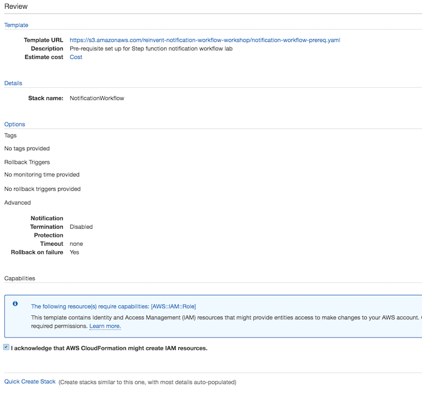
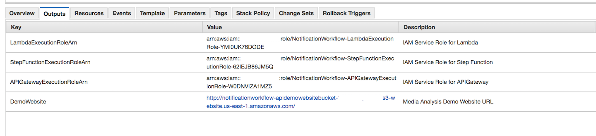

[Back to main guide](../README.md)|[Next](create-lambda-functions.md)

___

# 1. Lab Setup

In this activity we will deploy the CloudFormation template to create required IAM roles and configure S3 bucket for hosting static web application.

___

## Deploy the CloudFormation Template

1. Click on one of the buttons below to launch CloudFormation stack in one of the AWS regions.

Region | Launch
-------|-----
US East (N. Virginia) | 
US West (Oregon) | 

2. Click **Next** on the Select Template page.

3. Enter a **Stack Name** or leave the default and click **Next**.

4. On the Options page, leave all the defaults and click **Next**.

5. On the Review page, check the box to acknowledge that CloudFormation will create IAM resources and click **Create**.
    

6. Click on Stacks in  the top navigation to see the CloudFormation Stack screen. You should see the `NotificationsWorkflow` CloudFormation template in progress.

7. After CloudFormation template is complete, select the stack Name - `NotificationsWorkflow`, Click on the **Resources** tab from the bottom pane. You will see various AWS resources including S3 buckets and IAM roles created.

8. Make a Note of the stack Output parameters. You can find the stack output at the **Outputs** tab from the bottom pane.

	
___

[Back to main guide](../README.md)|[Next](create-lambda-functions.md)