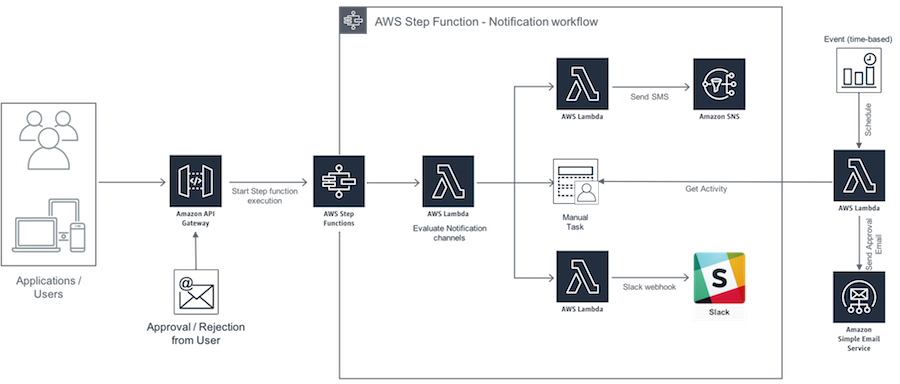
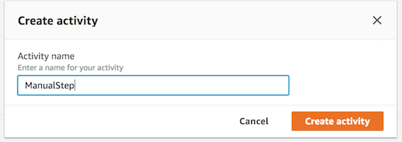
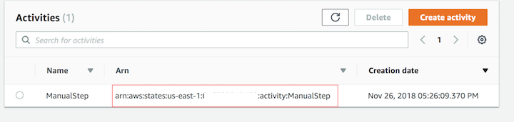
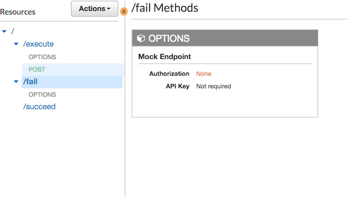
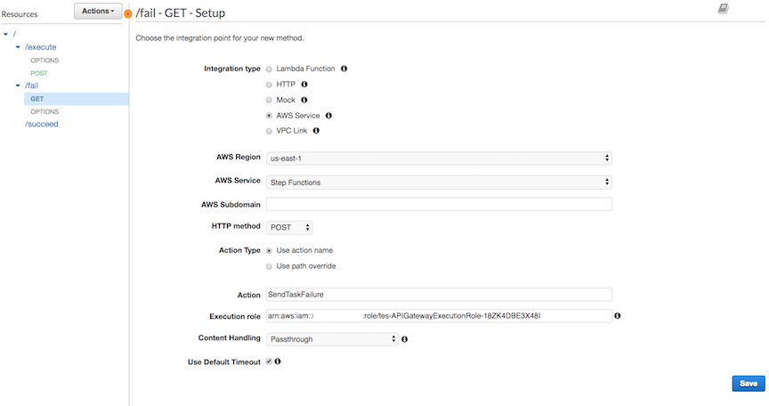
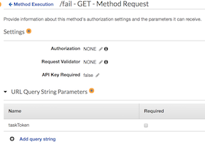
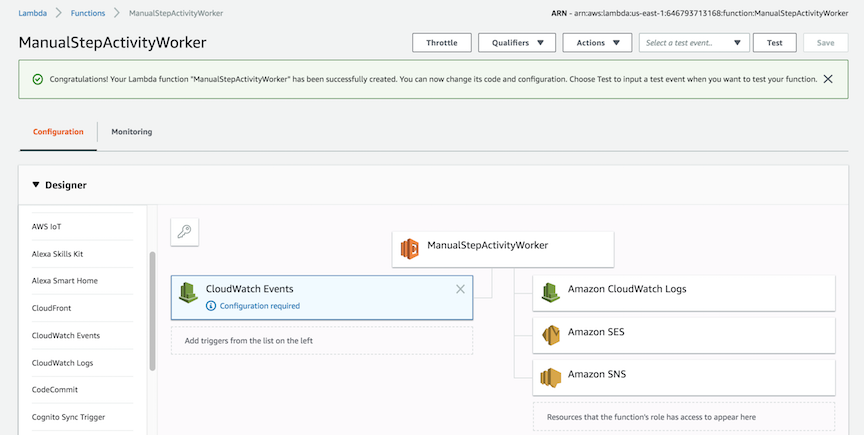
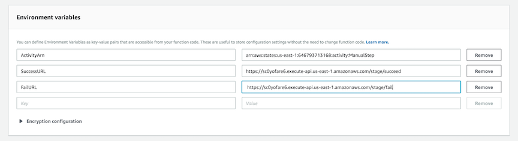
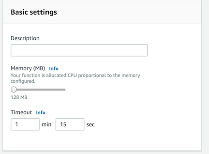
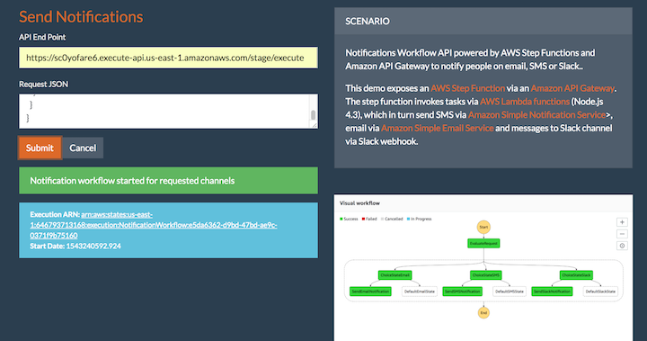

[Back to main guide](../README.md)|[Next](cleanup.md)

___

# 6. Adding manual approval step to the workflow


___

## Task 1 - Create an activity
1. In the **Step Functions** console, choose **Activities** and create an activity called `ManualStep`.

  

2. Make a note of ARN of this activity.

    

## Task 2 - Modify the State Machine 

Update your state machine (NotificationWorkflow) to include a task that models the approval process on the Step Functions console.

1. In the [Step Functions console](https://console.aws.amazon.com/states/home?region=us-east-1#/), choose **State machines** , select `NotificationWorkflow` and click **Edit**.
2. Update Reference in `SendEmailNotification` task of the **State machine** with **ARN** of **ManualStep** activity. Also add `"TimeoutSeconds": 3600,` to the **task**
3. Click **Save** to save the changes.

## Task 3 - Create and deploy an API
Next, create and deploy public URIs for calling the **SendTaskSuccess** or **SendTaskFailure** API action using **API Gateway**.

1. Open your **API (NotificationAPI)** in API Gateway console. Create two new resources under the root (/) called `succeed` and `fail`, and for each resource, create a **GET** method.

 

2. You now need to configure each method. Start by the **/fail GET** method and configure it with the following values:
  - For **Integration type**, choose **AWS Service**.
  - For **AWS Service**, choose **Step Functions**.
  - For **HTTP method**, choose **POST**.
  - For **Region**, choose the **region** where you have created step function.
  - For **Action**, enter `SendTaskFailure`.
  - For **Execution**, enter the **APIGatewayToStepFunctions** role ARN.

 

3. To be able to pass the `taskToken` through the URI, navigate to the **Method Request** section, and add a **URL Query String parameters** called `taskToken`.

 

4. Then, navigate to the **Integration Request** section and add a **Mapping Template** of type **application/json** to inject the query string parameter into the body of the request. Accept the change suggested by the security warning. This sets the body pass-through behavior to When there are no templates defined (Recommended). The following code does the mapping:

```JavaScript
{
   "cause": "Reject link was clicked.",
   "error": "Rejected",
   "taskToken": "$input.params('taskToken')"
}
```

5. When you are finished, choose **Save**.
6. Next, configure the **/succeed GET** method. The configuration is very similar to the **/fail GET** method. The only difference is for **Action** choose `SendTaskSuccess`, and set the **mapping** as follows:

```JavaScript
{
  "output": "\"Approve link was clicked.\"",
  "taskToken": "$input.params('taskToken')"
}

```

7. The last step on the API Gateway console after configuring your API actions is to deploy them to **stage**. 

8. Note down the **Invoke URL** for both **/succeed GET** and **/fail GET** methods.

## Task 4 - Create an activity worker Lambda function
1. create the Lambda function `ManualStepActivityWorker` using the following Node.js 4.3 code. The function receives the taskToken and input JSON document from StepFunctions. It embeds the information into an email, and sends out the email to the approver. Choose the lambda execution role created by your cloud formation template.

```JavaScript
'use strict';
console.log('Loading function');
const aws = require('aws-sdk');
const stepfunctions = new aws.StepFunctions();
const ses = new aws.SES();
exports.handler = (event, context, callback) =>
{

    var taskParams = {
        activityArn: process.env.ActivityArn
    };

    stepfunctions.getActivityTask(taskParams, function(err, data)
    {
        if (err)
        {
            console.log(err, err.stack);
            context.fail('An error occured while calling getActivityTask.');
        }
        else
        {
            if (data === null || data.input == undefined)
            {
                console.log('No activities received after 60 seconds.');
                // No activities scheduled
                context.succeed('No activities received after 60 seconds.');
                
            }
            else
            {

                var input = JSON.parse(data.input);
               
                var emailParams = {
                    Destination:
                    {
                        ToAddresses: [
                            input.email.emailAddress
                        ]
                    },
                    Message:
                    {
                        Subject:
                        {
                            Data: input.email.subject,
                            Charset: 'UTF-8'
                        },
                        Body:
                        {
                            Html:
                            {
                                Data: input.email.messageBody + '<br />' +
                                    'Your approval is required for this process!' +
                                    'Can you please approve:<br />' +
                                    process.env.SuccessURL + '?taskToken=' + encodeURIComponent(data.taskToken) + '<br /><br />' +
                                    'Or reject:<br />' +
                                    process.env.FailURL + '?taskToken=' + encodeURIComponent(data.taskToken),
                                Charset: 'UTF-8'
                            }
                        }
                    },
                    Source: input.email.emailAddress,
                    ReplyToAddresses: [
                        input.email.emailAddress
                    ]
                };

                ses.sendEmail(emailParams, function(err, data)
                {
                    if (err)
                    {
                        console.log(err, err.stack);
                        context.fail('Internal Error: The email could not be sent.');
                    }
                    else
                    {
                        console.log(data);
                        context.succeed('The email was successfully sent.');
                    }
                });
            }
        }

    });
};
```

2. In **Add triggers** pane , choose CloudWatch Events.

 

3. In **Configure triggers** pane, choose **Cretate New Role** option and provide name for the role. 

4. In Rule type, choose **Schedule expression** and enter  `rate(1 Minute)` in **Schedule expression** text field. (This is the poll rate for the
activity. This should be above the rate at which the activities are scheduled by a safety margin).

5. Select **Enable trigger** option. 

6. Click **Add** to add trigger as event source for your lambda funciton.  

6. Add `ActivityArn`, `FailURL` and `SuccessURL` as **Environment variables** with corresponding **values**.

 

7. Increase the **timeout** of the Lambda function to 1 minute 15 seconds. This allows the function to wait for an activity to become available, and gives it extra time to call SES to send the email. For all other settings, use the Lambda console defaults.

 


8. Click **Save** to save the changes.

## Task 5 - Test Manual Approval
1. Open your **static web site** from **Browser**.
2. Enter the **Invoke URL** of **NotificationAPI** at **API End Point** text field. 
3. Provide input **Request JSON** in **below format**.
```JavaScript
{
  "email" : {
    "emailAddress": "< email id>", 
    "subject" : "New Regarding earlier discussion",
    "messageBody" : "test email body"
  }, 
  "sms" : {
    "phoneNumber" : "<phone no>",
    "messageBody" : "test sms"
  }, 
  "slack" : {
    "webhook": "https://hooks.slack.com/services/asdfasdf/adfwbft/wueyriuiwr",
    "messageBody" : {
      "channel": "#general",
      "text": "test slack message"
    }
  }
}
```
4. Click **Submit** to start the **State Machine**.
5. You can view the progress of **State Machine** by selecting the link returned by API.
    
    

6. Verify that you have received **email** with links to approve or reject.

7. Click on either Approve or Reject link and verify the state in **State Machine**.  
___
[Back to main guide](../README.md)|[Next](cleanup.md)