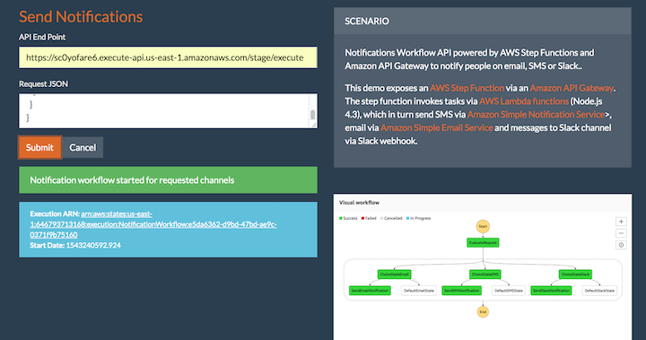

[Back to main guide](../README.md)|[Next](optional-manual-approval.md)

___

# 5. Deploying static web application for testing NotificationAPI

You will deploy a static website in [Amazon Simple Storage Service](https://aws.amazon.com/s3/) (Amazon S3) to invoke NotificationAPI (an [Amazon API Gateway](https://aws.amazon.com/api-gateway/) API)
___

## Task 1 - Deploy static web application

1.	Log in to the [Amazon S3 console](https://console.aws.amazon.com/s3/home).
2.  Locate **static web-site bucket** created by your **CloudFormation template**. 
3.	Download **[web.zip](../src/web.zip)**, unzip and **Upload** the content of the **web folder** to static web-site **S3 bucket**. 


4.  Update the access permission for uploaded content by choosing **Actions, Make Public**. 

    

5. Open your **static web site** from **Browser**. Refer to **Output** section of your **CloudFormation** stack for **static web site URL**.
    

## Task 2 - Test NotificationAPI
1. Open your **static web site** from **Browser**.
2. Enter the **Invoke URL** of **NotificationAPI** at **API End Point** text field. 
3. Provide input **Request JSON** in **below format**.
```JavaScript
{
  "email" : {
    "emailAddress": "< email id>", 
    "subject" : "sample subject from builder session",
    "messageBody" : "test email body"
  }, 
  "sms" : {
    "phoneNumber" : "+15417543010",
    "messageBody" : "test sms"
  }, 
  "slack" : {
    "webhook": "https://hooks.slack.com/services/asdfasdf/adfwbft/wueyriuiwr",
    "messageBody" : {
      "channel": "#general",
      "text": "test slack message"
    }
  }
}
```
4. Click **Submit** to start the **State Machine**.
5. You can view the progress of **State Machine** by selecting the link returned by API.
    
    

6. Verify that you have received **email, SMS or slack** message as per provided request JSON.

**You can also send messages only to selected notification channels by modifying the input request JSON. Example - If you do not provide the SMS JSON object in request JSON then SMS will not be sent.**   
___
[Back to main guide](../README.md)|[Next](optional-manual-approval.md)