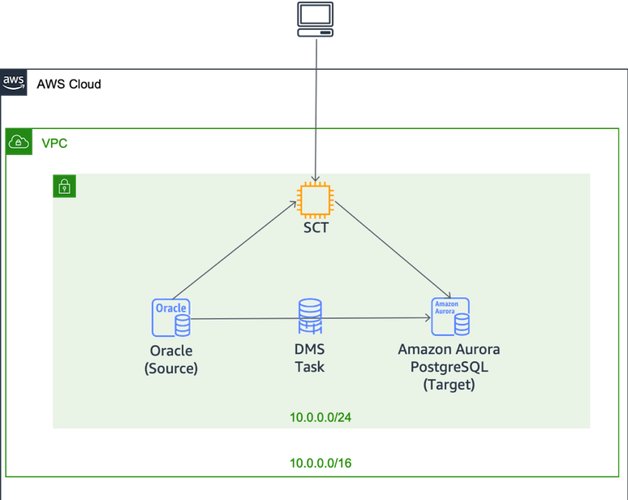

# AWS Database Migration Workshop

Amazon Aurora is a MySQL and PostgreSQL compatible relational database built for the cloud that combines the performance and availability of high-end commercial databases with the simplicity and cost-effectiveness of open-source databases. 

In this hands-on workshop, you learn to migrate Oracle databases to Aurora PostgreSQL with minimum downtime using the AWS Schema Conversion Tool (SCT) and AWS Database Migration Service (DMS). 

This lab demonstrates how to use:

- AWS Schema Conversion Tool (SCT) for database schema conversion
- AWS Database Migration Service (DMS) for data migration

___
# Reference Architecture

___

## Prerequisites

The following prerequisites must be met before you begin the workshop:

- AWS Console Access
- [RDP client](https://docs.aws.amazon.com/AWSEC2/latest/WindowsGuide/connecting_to_windows_instance.html?icmpid=docs_ec2_console#rdp-prereqs)
___

## Workshop Activities

1. [Lab Setup](lab-guides/lab-setup.md)
2. [Schema Conversion Tool (SCT)](lab-guides/sct.md)
3. [Database Migration Service (DMS)](lab-guides/dms.md)
4. [Optional :](lab-guides/optional1.md)
5. [Optional :](lab-guides/optional2.md)
6. [Optional :](lab-guides/optional3.md)
7. [Cleanup](lab-guides/cleanup.md)

## License

This library is licensed under the MIT-0 License. See the LICENSE file.

___