[Back to main guide](../README.md)|[Next](optional1.md)

___

# Database Migration Service (DMS)

The AWS Database Migration Service helps you migrate databases to AWS easily and securely. The source database remains fully operational during the migration, minimizing downtime to applications that rely on the database. The AWS Database Migration Service can migrate your data to and from most widely used commercial and open-source databases. AWS Database Migration Service can also be used for continuous data replication with high availability.

This lab will walk you through the steps to migrate data from an Oracle database hosted on an EC2 instance to Amazon Aurora PostgreSQL. 

In this activity, you perform the following tasks:

- Create a DMS Replication Instance
- Create DMS source and target endpoints
- Run a DMS Replication Task for full-load (migration of initial data)
    - Check the source database content for post-replication validation
    - Drop foreign keys and disable triggers on the target database
    - Setup and run a full-load Replication Task
    - Validate the data replication result
    - Restore the foreign keys
- Run a DMS Replication Task for Change Data Capture (CDC)
    - Enable CDC on the source database
    - Set up and run a Replication Task
    - Introduce changes at the source database
    - Validate the CDC result at the target database
    - Enable the triggers after the CDC is complete

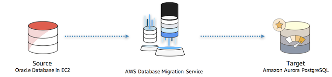
___

## Task 1 - Create a DMS Replication Instance

1. Go to the [AWS DMS console](https://console.aws.amazon.com/dms/v2/) and click on Replication Instances on the left-hand menu. This will launch the **Replication instance** screen in the Database Migration Service.
2. Click on the **Create replication instance** button on the top right side.

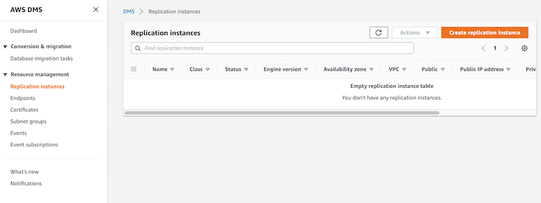

3. Configure the replication instance with the following parameter values. Then, click on the **Create** button.

Parameter | Value
--- | --- 
Name | replication-instance 
Description | Oracle to Aurora DMS replication instance 
Instance Class | dms.t2.medium 
Replication engine version | 2.4.5 
VPC | vpc-xxxxxxxxx (VpcId from CloudFormation stack output)
Multi-AZ | No 
Publicly accessible | Unchecked 

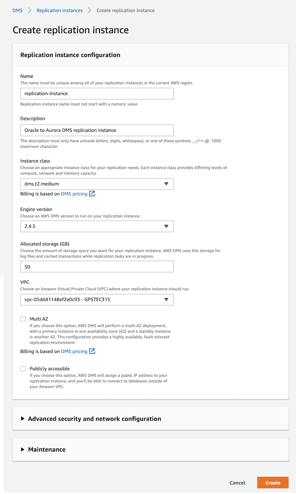

_Note: Creation of the replication instance takes a few minutes. While waiting for the replication instance to be created, you can proceede with creation of source and target database endpoints in the next step. However, you can test the endpoint connectivity only after the replication instance has been created._

___

## Task 2 - Create DMS source and target endpoints

1. Click on the **Endpoints** link on the left menu, and then click on Create endpoint on the top right corner.

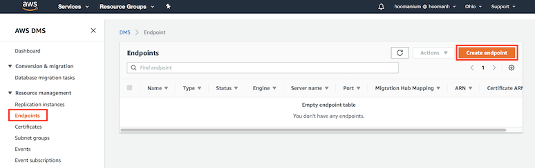

2. Enter the Connection details for the source endpoint as shown in the following table. 

Parameter | Value
--- | ---
Endpoint type | Source endpoint
Endpoint identifier | oracle-source
Source engine | oracle
Server name | Get `OracleSCTInstancePrivateIP` from CloudFormation stack output
Port | 1521
SSL mode | none 
User name | hr
Password | hr123
SID | XE

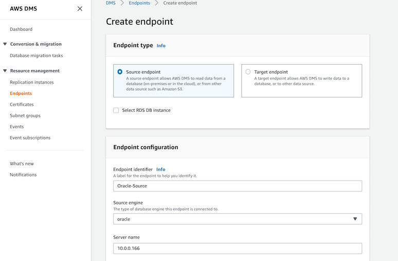

3. Once the information has been entered, click **Run Test**. When the status turns to successful, click **Create endpoint**.

4. Repeat the previous steps to create the target endpoint for the Aurora PostgreSQL database with the values. 

Parameter | Value 
--- | --- 
Endpoint type | Target endpoint 
Endpoint identifier | aurora-postgresql-target 
Source engine | aurora-postgresql 
Server name | Get `AuroraPostgreSQLEndpoint` from CloudFormation stack output
Port | 5432 
SSL mode | none 
User name | postgres 
Password | Aurora321 
Database name | AuroraPostgreSQLDB 

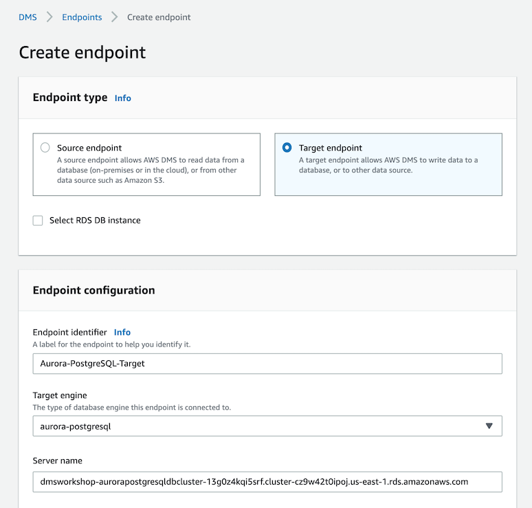

5. Once the information has been entered, click **Run Test**. When the status turns to successful, click **Create endpoint**.

___

## Task 3 - Run the DMS Replication Task for full load (replicating the initial data)

#### Check the source database content for post-replication validation
1. Connect to the **OracleXE-SCT** EC2 instance using the following password 
    **Windows password**: GPSreInvent@321
2. Launch **SQL Develpoer** from the shortcut on the desktop. 
3. Right Click on `XE` under Connections and select properties to verify the following parameters.

Parameter | Value 
--- | --- 
Connection Name | XE 
Username| hr 
Password | hr123 
Save Password | checked 
Hostname | Get `OracleSCTInstancePrivateIP` from CloudFormation stack output
Port| 1521 
SID | XE 

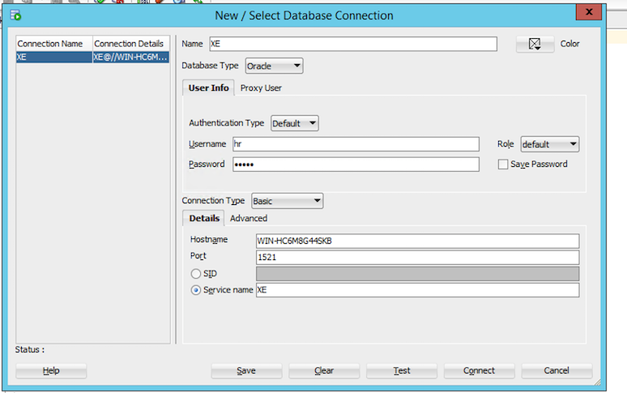

4. After you connect to the Oracle database, run the following query on the SQL window to get a count of the rows in the tables.

````
SELECT 'regions' TABLE_NAME, COUNT(*) FROM HR.REGIONS  UNION
SELECT 'locations' TABLE_NAME, COUNT(*) FROM  HR.LOCATIONS UNION
SELECT 'departments' TABLE_NAME, COUNT(*) FROM  HR.DEPARTMENTS UNION
SELECT 'jobs' TABLE_NAME,  COUNT(*) FROM HR.JOBS UNION
SELECT 'employees' TABLE_NAME, COUNT(*) FROM  HR.EMPLOYEES UNION
SELECT 'job_history' TABLE_NAME, COUNT(*) FROM  HR.JOB_HISTORY UNION
SELECT 'countries' TABLE_NAME, COUNT(*) FROM HR.COUNTRIES Order by TABLE_NAME;
````
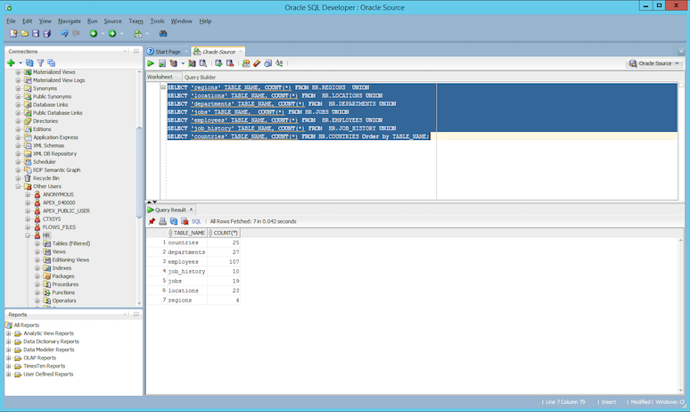

#### Configure the target database schema for full load replication
Before running DMS Replication Task, you need to disable the foreign keys and triggers on the target database. 

1. Right Click on `AuroraPostgreSQL` under Connections and select properties to verify the following parameters.

Parameter | Value
--- | ---
Connection Name | AuroraPostgreSQL
Username| postgres
Password | Aurora321 
Save Password | checked 
Hostname | Get `AuroraPostgreSQLEndpoint` from CloudFormation stack output
Port| 5432
Database name | AuroraPostgreSQLDB


2. Drop foreign keys and disable triggers on the target Aurora database. After you connect to the Aurora PostgreSQL database successfully, run the following query in the SQL window to drop foreign keys.

**Drop foreign keys**

```
ALTER TABLE hr.countries DROP CONSTRAINT country_reg_fk;
ALTER TABLE hr.departments DROP CONSTRAINT dept_loc_fk;
ALTER TABLE hr.departments DROP CONSTRAINT dept_mgr_fk;
ALTER TABLE hr.employees DROP CONSTRAINT emp_dept_fk;
ALTER TABLE hr.employees DROP CONSTRAINT emp_job_fk;
ALTER TABLE hr.employees DROP CONSTRAINT emp_manager_fk;
ALTER TABLE hr.job_history DROP CONSTRAINT jhist_dept_fk;
ALTER TABLE hr.job_history DROP CONSTRAINT jhist_emp_fk;
ALTER TABLE hr.job_history DROP CONSTRAINT jhist_job_fk;
ALTER TABLE hr.locations DROP CONSTRAINT loc_c_id_fk;
```

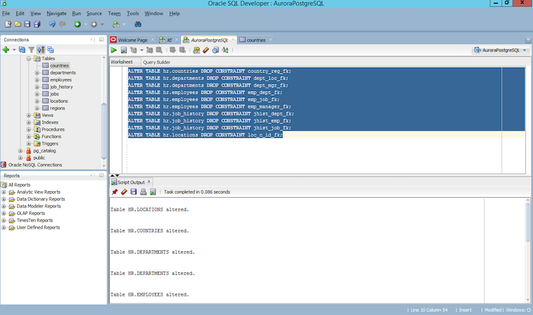

**Disable TRIGGERS**  

```
DROP TRIGGER IF EXISTS secure_employees ON hr.employees;
DROP TRIGGER IF EXISTS update_job_history ON hr.employees;

```

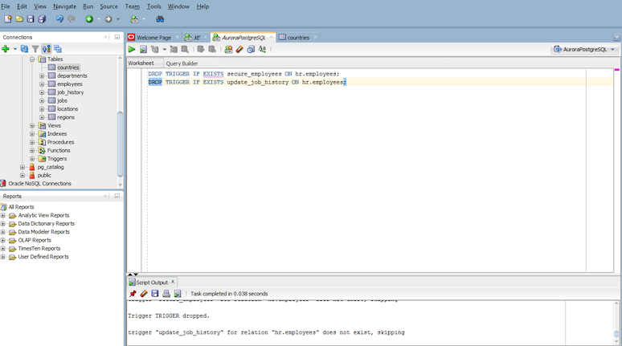

#### Configure and run Replication Task
AWS DMS uses a Replication Task to migrate the data from source to the target database. In this part of the lab, you are going to create a Replication Task for migrating the existing data.

1. Click on **Database migration tasks** on the left-hand menu, then click on the **Create task** button on the top right corner.

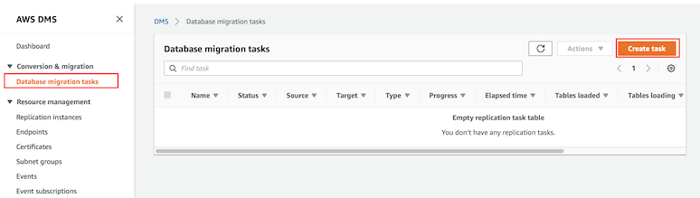

2. Create a data migration task with the following values for migrating the `HR` database.

Parameter | Value
--- | ---
Task identifier | oracle-migration-task
Replication instance | your replication instance
Source database endpoint | oracle-source
Target database endpoint | aurora-postgresql-target
Migration type | Migrate existing data
Start task on create | Checked
Target table preparation mode | Truncate
Include LOB columns in replication | Limited LOB mode
Max LOB size (KB) | 32
Enable validation | Unchecked
Enable CloudWatch logs | Checked

*Enabling logging would help debug issues that DMS encounters during data migration*

3. Expand the Table mappings section, and select Guided UI for the editing mode
4. Click on Add new selection rule button and enter the following values:

Parameter | Value
----- | -----
Schema name | HR
Table name| %
Action | Include

5. Next, expand the Transformation rules section, and click on Add new transformation rule. Then, create the following rules:

Parameter | Value
-------- | --------
Target | Schema
Schema name | HR
Action | Make lowercase

Parameter | Value
-------- | --------
Target | Table
Schema Name | HR
Table Name | %
Action | Make lowercase

Parameter | Value
-------- | --------
Target | Column
Schema Name | HR
Table Name | %
Column Name | %
Action | Make lowercase

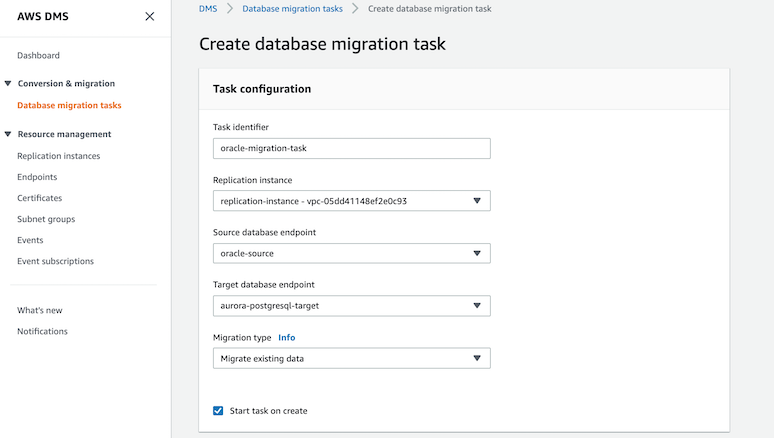

6. After entering the values click on **Create task**.
7. At this point, the task should start migrating data from the source Oracle database to the Amazon Aurora RDS instance.
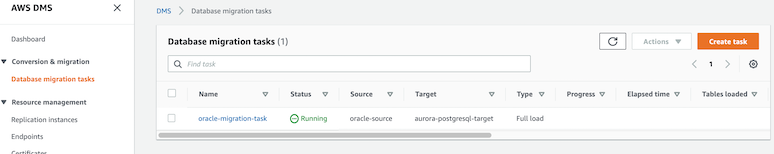
8. Go to **Database migration tasks** to monitor the task progress and once the task status is **Load complete**, your data should have been migrated to the target database.
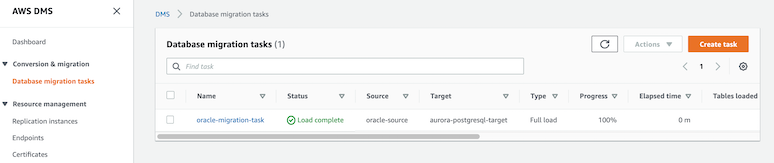

#### Validate the migration result 

1. Click on your task **oracle-migration-task** and scroll to the **Table statistics** section to view how many rows have been moved.
    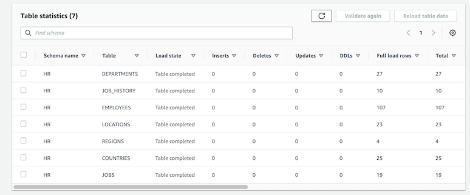
2. If there is any error, the status color changes from green to red. Click on the **View logs** link for the logs.
3. On the target Aurora database, check the tables for migrated data using SQL Developer.
     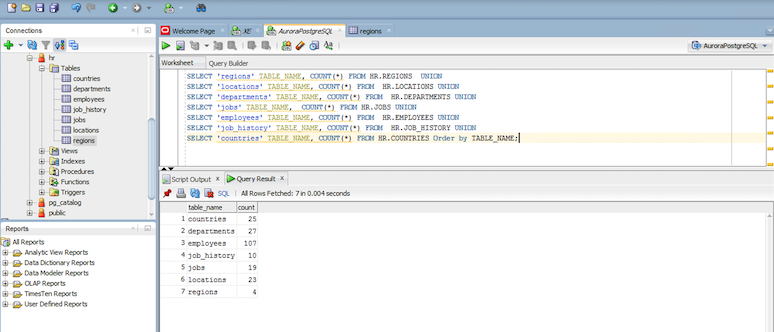

#### Restore the foreign keys 
1. After the full load is complete, enable the foreign key constraints.

```
### Add foreign keys on the target database
ALTER TABLE hr.locations
ADD CONSTRAINT loc_c_id_fk FOREIGN KEY (country_id) 
REFERENCES hr.countries (country_id)
ON DELETE NO ACTION;

ALTER TABLE hr.countries
ADD CONSTRAINT country_reg_fk FOREIGN KEY (region_id) 
REFERENCES hr.regions (region_id)
ON DELETE NO ACTION;

ALTER TABLE hr.employees
ADD CONSTRAINT emp_dept_fk FOREIGN KEY (department_id) 
REFERENCES hr.departments (department_id)
ON DELETE NO ACTION;

ALTER TABLE hr.job_history
ADD CONSTRAINT jhist_dept_fk FOREIGN KEY (department_id) 
REFERENCES hr.departments (department_id)
ON DELETE NO ACTION;

ALTER TABLE hr.departments
ADD CONSTRAINT dept_loc_fk FOREIGN KEY (location_id) 
REFERENCES hr.locations (location_id)
ON DELETE NO ACTION;

ALTER TABLE hr.departments
ADD CONSTRAINT dept_mgr_fk FOREIGN KEY (manager_id) 
REFERENCES hr.employees (employee_id)
ON DELETE NO ACTION;

ALTER TABLE hr.employees
ADD CONSTRAINT emp_manager_fk FOREIGN KEY (manager_id) 
REFERENCES hr.employees (employee_id)
ON DELETE NO ACTION;

ALTER TABLE hr.job_history
ADD CONSTRAINT jhist_emp_fk FOREIGN KEY (employee_id) 
REFERENCES hr.employees (employee_id)
ON DELETE NO ACTION;

ALTER TABLE hr.employees
ADD CONSTRAINT emp_job_fk FOREIGN KEY (job_id) 
REFERENCES hr.jobs (job_id)
ON DELETE NO ACTION;

ALTER TABLE hr.job_history
ADD CONSTRAINT jhist_job_fk FOREIGN KEY (job_id) 
REFERENCES hr.jobs (job_id)
ON DELETE NO ACTION;

```

___
## Task 4 - Run a DMS Replication Task for Change Data Capture (CDC)

You can use AWS Database Migration Service to perform continuous data replication. This helps you migrate your databases to AWS with virtually no downtime. All data changes to the source database that occur during the migration are continuously replicated to the target, allowing the source database to be fully operational during the migration process. After the database migration is complete, the target database will remain synchronized with the source for as long as you choose, allowing you to switchover the database at a convenient time.

Oracle offers two methods for reading the redo logs when doing change processing, Oracle LogMiner and Oracle Binary Reader. Oracle LogMiner provides a SQL interface to Oracle’s online and archived redo log files. Binary Reader is an AWS DMS feature that reads and parses the raw redo log files directly.

By default, AWS DMS uses Oracle LogMiner for change data capture (CDC).

To capture change data, the source database must be in ARCHIVELOG mode and supplemental logging must be enabled.

Similarly, you need to enable table-level supplemental logging for each table that you want to migrate.

Refer to [Using Oracle LogMiner or Oracle Binary Reader for Change Data Capture (CDC)](https://docs.aws.amazon.com/dms/latest/userguide/CHAP_Source.Oracle.html#CHAP_Source.Oracle.CDC) for more details.  

_**Note: For this workshop we have already made these changes in the source Oracle database.**_

#### Configure and run a CDC Replication Task
In this part of the lab you are going to create another Database Migration Task for capturing data changes from the source Oracle database and migrate to target Aurora PostgreSQL.

1. Click on **Database migration tasks** on the left-hand menu, then click on the **Create task** button on the top right corner.


2. Create a data migration task with the following values for migrating the `HR` database.

Parameter | Value
--- | ---
Task identifier | oracle-migration-task-cdc
Replication instance | your replication instance
Source database endpoint | oracle-source
Target database endpoint | aurora-postgresql-target
Migration type | Replicate data changes only
Start task on create | Checked
CDC start mode | Don’t use custom CDC start mode
CDC stop mode | Don’t use custom CDC stop mode
Target table preparation mode | Do nothing
Include LOB columns in replication | Limited LOB mode
Max LOB size (KB) | 32
Enable validation | Unchecked
Enable CloudWatch logs | Checked

*Enabling the logging would help debugging issues that DMS encounters during data migration*

3. Expand the Table mappings section, and select Guided UI for the editing mode
4. The Table mappings are as below which are same as the mappings of the previous full-load replication task. Click on Add new selection rule button and enter the following values.

Parameter | Value
----- | -----
Schema name | HR
Table name| %
Action | Include

5. Next, expand the Transformation rules section, and click on Add new transformation rule. Then, create the following rules:

Parameter | Value
-------- | --------
Target | Schema
Schema name | HR
Action | Make lowercase

Parameter | Value
-------- | --------
Target | Table
Schema Name | HR
Table Name | %
Action | Make lowercase

Parameter | Value
-------- | --------
Target | Column
Schema Name | HR
Table Name | %
Column Name | %
Action | Make lowercase

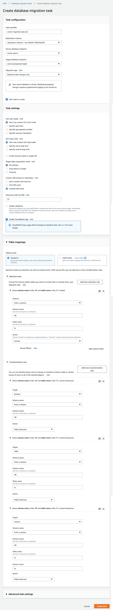

6. After entering the values click on **Create task**.

7. Wait till the task status changes to **Replication ongoing**
    
    

#### Validate the data replication result 

1. Log in to the SQL Developer connecting to the source Oracle database on **OracleXE-SCT** EC2 instance. 
2. Verify records in existing `REGIONS` table in `HR` schema.

````
SELECT * FROM HR.REGIONS;
````

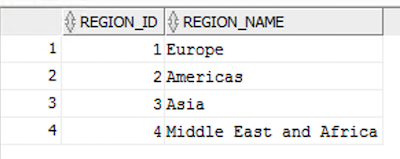

3. Add additional two rows to `REGIONS` table

````
INSERT INTO HR.REGIONS VALUES (5,'APAC');

INSERT INTO HR.REGIONS VALUES (6,'LATIN AMERICA');

COMMIT WORK;

````

4. Log in to the SQL Developer connecting to the target Aurora PostgreSQL database on **OracleXE-SCT** EC2 instance.

5. Verify whether the changes are migrated to `REGION` table in target Aurora PostgreSQL database.

````
SELECT * FROM hr.regions;
````

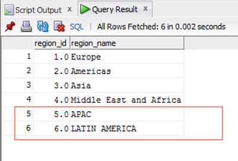

6. You can further verify the number of inserts, deletes, updates, and DDLs by viewing the **Table statistics** of **Database migration tasks** in AWS console.

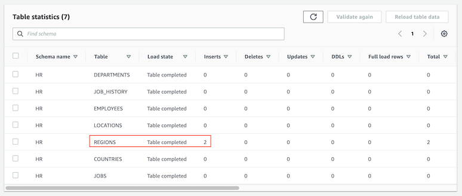

#### Restore the triggers 

After completing the CDC, you need to restore the triggers in the target database. 

````
CREATE TRIGGER secure_employees
BEFORE INSERT OR UPDATE OR DELETE
ON hr.employees
FOR EACH STATEMENT
EXECUTE PROCEDURE hr.secure_employees$employees();

CREATE TRIGGER update_job_history
AFTER UPDATE OF JOB_ID, DEPARTMENT_ID
ON hr.employees
FOR EACH ROW
EXECUTE PROCEDURE hr.update_job_history$employees();

````

___ 

## Conclusion
This part of the workshop demonstrated heterogeneous database migration, from Oracle to Aurora PostgreSQL by AWS Database Migration Service (DMS). The AWS DMS provides both full-load database replication as well as Data Change Capture in real time.
___

[Back to main guide](../README.md)|[Next](optional1.md)