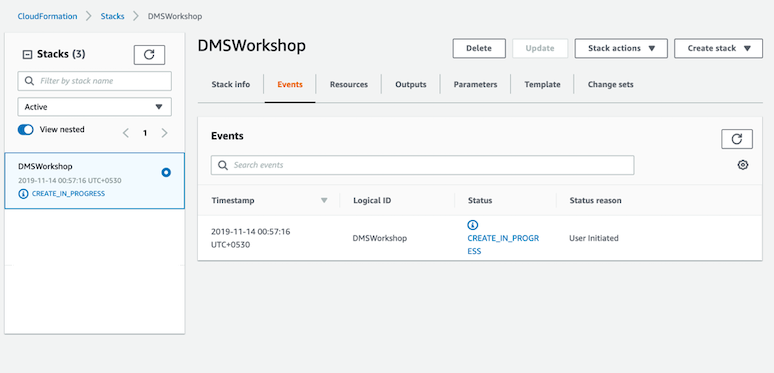
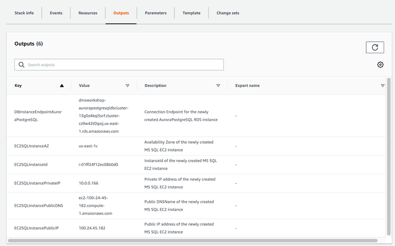

[Back to main guide](../README.md)|[Next](sct.md)

___

# Lab Setup

In this activity, we will deploy the CloudFormation template to create the lab environment.

The environment for this lab consists of:
- An EC2 instance with following components 
   - AWS Schema Conversion Tool (SCT)
   - Source Oracle database
   - Oracle SQL Developer
   - A sample web application 
- An Amazon Aurora PostgreSQL instance used as the target database

___

## Deploy the CloudFormation Template

1. Click on one of the buttons below to launch the CloudFormation stack in one of the AWS regions.

Region | Launch
-------|-----
US East (N. Virginia) | 
US West (Oregon) | 

2. Click **Next** on the Select Template page.

3. Enter a **Stack Name** or accept the default and click **Next**.

4. On the Options page, accept all the defaults and click **Next**.

5. On the Review page, click **Create**.
    
6. Click on Stacks in the navigation panel to list the CloudFormation Stacks. You should see the `DMSWorkshop` stack creation in progress.

7. After the stack creation is complete, select the stack Name - `DMSWorkshop`, Click on the **Resources** tab. You will see various AWS resources created.

8. Make a note of the stack output parameters. You can find the stack output parameters in the **Outputs** tab.

___

[Back to main guide](../README.md)|[Next](sct.md)